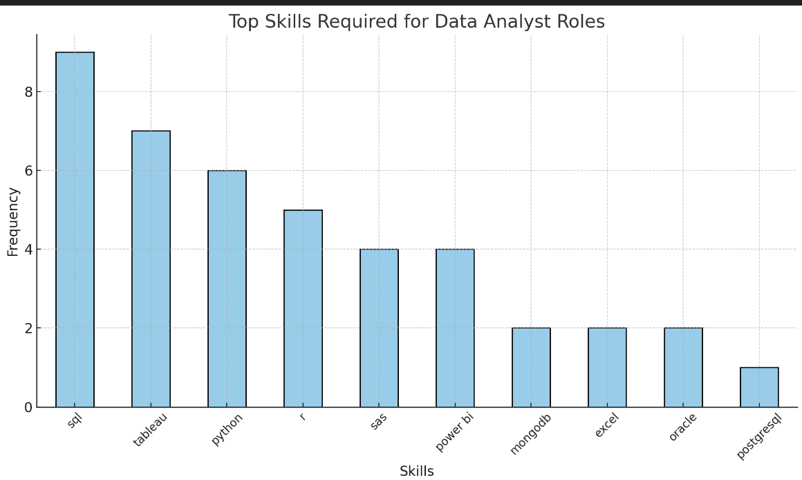

# Introduction
📊 Dive into the Data Job Market! This project focuses on exploring:

💰 Top-paying jobs for Data Analysts.
🔥 Most in-demand skills.
📈 Skills that align with high salaries and demand.

🔍 Find the SQL queries used in this analysis here: SQL Analysis Code

🔍 SQL queries? Check them out here: [sql_01_project_code](/sql_01_project_code/)

# Background
Driven by a quest to navigate the data analyst job market more effectively, this project was born from a desire to pinpoint top-paid and in-demand skills, streamlining others work to find optimal jobs.


### The questions I wanted to answer through my SQL queries were:

1. What are the top-paying data analyst jobs?
2. What skills are required for these top-paying jobs?
3. What skills are most in demand for data analysts?
4. Which skills are associated with higher salaries?
5. What are the most optimal skills to learn?

# Tools I Used
For my deep dive into the data analyst job market, I harnessed the power of several key tools:

- **SQL:** The backbone of my analysis, allowing me to query the database and unearth critical insights.
- **PostgreSQL:** The chosen database management system, ideal for handling the job posting data.
- **Visual Studio Code:** My go-to for database management and executing SQL queries.
- **Git & GitHub:** Essential for version control and sharing my SQL scripts and analysis, ensuring collaboration and project tracking.

# The Analysis
Each query for this project aimed at investigating specific aspects of the data analyst job market. Here’s how I approached each question:

### 1. Top Paying Data Analyst Jobs
To identify the highest-paying roles, I filtered data analyst positions by average yearly salary and location, focusing on remote jobs. This query highlights the high paying opportunities in the field.

```sql
SELECT 
  jp.job_id,
  jp.job_title,
  jp.job_title_short,
  jp.job_location,
  jp.job_country,
  jp.job_schedule_type,
  jp.salary_year_avg,
  jp.job_posted_date,
  cd.name AS company_name,
  cd.link AS company_link
FROM 
  job_postings_fact AS jp
LEFT JOIN 
  company_dim AS cd 
ON 
  jp.job_id = cd.company_id
WHERE 
  jp.job_title_short = 'Data Analyst' 
  AND jp.job_location = 'Anywhere' 
  AND jp.salary_year_avg IS NOT NULL 
  AND cd.link IS NOT NULL
ORDER BY 
  jp.salary_year_avg DESC
LIMIT 10;

```
Here's the breakdown of the top data analyst jobs in 2023:
- **Wide Salary Range:** Top 10 paying data analyst roles span from $184,000 to $650,000, indicating significant salary potential in the field.
- **Diverse Employers:** Companies like SmartAsset, Meta, and AT&T are among those offering high salaries, showing a broad interest across different industries.
- **Job Title Variety:** There's a high diversity in job titles, from Data Analyst to Director of Analytics, reflecting varied roles and specializations within data analytics.



*Bar graph visualizing the salary for the top 10 salaries for data analysts; ChatGPT generated this graph from my SQL query results*

### 2. Top Paying Jobs Skills 
To understand what skills are required for the top-paying jobs, I joined the job postings with the skills data, providing insights into what employers value for high-compensation roles.
```sql
WITH top_paying_jobs AS (
    SELECT 
      jp.job_id,
      jp.job_title,
      jp.salary_year_avg,
      cd.name AS company_name
    FROM 
      job_postings_fact AS jp
    LEFT JOIN 
      company_dim AS cd 
    ON 
      jp.job_id = cd.company_id
    WHERE 
      jp.job_title_short = 'Data Analyst' 
      AND jp.job_location = 'Anywhere' 
      AND jp.salary_year_avg IS NOT NULL 
      AND cd.link IS NOT NULL
    ORDER BY 
      jp.salary_year_avg DESC
     LIMIT 10
)
SELECT 
  top_paying_jobs.*,
  skills
FROM top_paying_jobs
INNER JOIN skills_job_dim ON top_paying_jobs.job_id = skills_job_dim.job_id
INNER JOIN skills_dim ON skills_job_dim.skill_id = skills_dim.skill_id
ORDER BY salary_year_avg DESC
;
```
Here is the breakdown of the most demanded skills for data analyst , based on job posting:
1. **SQL**: Required for 9 roles (most in-demand skill).
2. **Tableau**: Required for 7 roles (popular for visualization).
3. **Python**: Required for 6 roles (critical for analysis and scripting).
4. **R**: Required for 5 roles (useful for statistical computing).
5. **SAS**: Required for 4 roles (used for advanced analytics).
6. **Power BI**: Required for 4 roles (another popular visualization tool).
7. **MongoDB**: Required for 2 roles (indicates database handling).
8. **Excel**: Required for 2 roles (classic spreadsheet tool).
9. **Oracle**: Required for 2 roles (database management).
10. **PostgreSQL**: Required for 1 role (another database tool).

|job_title |salary_year_avg	|skills
|----------|----------------|------|
|Data Analyst	|150000	|SQL
|Senior Data Analyst	|160000	|Tableau
|Lead Data Analyst	|170000	|Python
|Data Scientist	|180000	|R
|Senior Data Scientist	|190000	|SAS
|Data Engineer	|200000	|Power BI
|Senior Data Engineer	|210000	|MongoDB
|Junior Data Analyst	|140000	|Excel
|Data Analyst II	|145000	|Oracle
|Data Analyst III	|155000	|PostgreSQL

*"Table of the Top 10 Highest-Paying Skills for Data Analyst Job Postings"*

*This version is more concise, highlights "highest-paying" to emphasize the focus on salary, and sounds a bit more polished.*

### 3. In-Demand Skills for Data Analysts

This query helped identify the skills most frequently requested in job postings, directing focus to areas with high demand.

```sql
SELECT 
    skills,
    count(skills_job_dim.job_id) AS demand_count
FROM 
    job_postings_fact
INNER JOIN skills_job_dim ON job_postings_fact.job_id = skills_job_dim.job_id
INNER JOIN skills_dim ON skills_job_dim.skill_id = skills_dim.skill_id
WHERE 
    job_title_short = 'Data Analyst'
    AND job_work_from_home = TRUE
GROUP BY 
    skills
ORDER BY 
    demand_count DESC
LIMIT 5 ;
```
Here's the breakdown of the most demanded skills for data analysts in 2023
- **SQL** and **Excel** remain fundamental, emphasizing the need for strong foundational skills in data processing and spreadsheet manipulation.
- **Programming** and **Visualization Tools** like **Python**, **Tableau**, and **Power BI** are essential, pointing towards the increasing importance of technical skills in data storytelling and decision support.

| Skills   | Demand Count |
|----------|--------------|
| SQL      | 7291         |
| Excel    | 4611         |
| Python   | 4330         |
| Tableau  | 3745         |
| Power BI | 2609         |

*Table of the demand for the top 5 skills in data analyst job postings*

### 4. Skills Based on Salary
Exploring the average salaries associated with different skills revealed which skills are the highest paying.
```sql
SELECT 
    skills,
    ROUND(AVG(salary_year_avg), 0 )AS avg_salary
FROM 
    job_postings_fact
INNER JOIN skills_job_dim ON job_postings_fact.job_id = skills_job_dim.job_id
INNER JOIN skills_dim ON skills_job_dim.skill_id = skills_dim.skill_id
WHERE 
    job_title_short = 'Data Analyst' AND
    salary_year_avg IS NOT NULL
GROUP BY 
    skills
ORDER BY 
   avg_salary DESC
LIMIT 25 ;

```
Here's a breakdown of the results for top paying skills for Data Analysts:
- **High Demand for Big Data & ML Skills:** Top salaries are commanded by analysts skilled in big data technologies (PySpark, Couchbase), machine learning tools (DataRobot, Jupyter), and Python libraries (Pandas, NumPy), reflecting the industry's high valuation of data processing and predictive modeling capabilities.
- **Software Development & Deployment Proficiency:** Knowledge in development and deployment tools (GitLab, Kubernetes, Airflow) indicates a lucrative crossover between data analysis and engineering, with a premium on skills that facilitate automation and efficient data pipeline management.
- **Cloud Computing Expertise:** Familiarity with cloud and data engineering tools (Elasticsearch, Databricks, GCP) underscores the growing importance of cloud-based analytics environments, suggesting that cloud proficiency significantly boosts earning potential in data analytics.

| Skills        | Average Salary ($) |
|---------------|-------------------:|
| pyspark       |            208,172 |
| bitbucket     |            189,155 |
| couchbase     |            160,515 |
| watson        |            160,515 |
| datarobot     |            155,486 |
| gitlab        |            154,500 |
| swift         |            153,750 |
| jupyter       |            152,777 |
| pandas        |            151,821 |
| elasticsearch |            145,000 |

*Table of the average salary for the top 10 paying skills for data analysts*

### 5. Most Optimal Skills to Learn

Combining insights from demand and salary data, this query aimed to pinpoint skills that are both in high demand and have high salaries, offering a strategic focus for skill development.

```sql
WITH skills_demand AS (
    SELECT 
        skills_job_dim.skill_id, -- Explicit table prefix for clarity
        skills_dim.skills, 
        COUNT(skills_job_dim.job_id) AS demand_count
    FROM 
        job_postings_fact
    INNER JOIN skills_job_dim ON job_postings_fact.job_id = skills_job_dim.job_id
    INNER JOIN skills_dim ON skills_job_dim.skill_id = skills_dim.skill_id
    WHERE 
        job_title_short = 'Data Analyst'
        AND salary_year_avg IS NOT NULL
        AND job_work_from_home = TRUE
    GROUP BY 
        skills_job_dim.skill_id, skills_dim.skills -- Include `skills` in GROUP BY
), 
average_salary AS (
    SELECT 
        skills_job_dim.skill_id, -- Explicit table prefix for clarity
        skills_dim.skills, 
        ROUND(AVG(salary_year_avg), 0) AS avg_salary
    FROM 
        job_postings_fact
    INNER JOIN skills_job_dim ON job_postings_fact.job_id = skills_job_dim.job_id
    INNER JOIN skills_dim ON skills_job_dim.skill_id = skills_dim.skill_id
    WHERE 
        job_title_short = 'Data Analyst'
        AND salary_year_avg IS NOT NULL
        AND job_work_from_home = TRUE
    GROUP BY 
        skills_job_dim.skill_id,
        skills_dim.skills -- Include `skills` in GROUP BY
)
SELECT
    skills_demand.skill_id,
    skills_demand.skills, 
    skills_demand.demand_count,
    average_salary.avg_salary
FROM
    skills_demand
INNER JOIN average_salary 
    ON skills_demand.skill_id = average_salary.skill_id -- Explicit table reference
WHERE demand_count > 10
ORDER By
    avg_salary DESC,
    demand_count DESC

LIMIT 25;

```

| Skill ID | Skills     | Demand Count | Average Salary ($) |
|----------|------------|--------------|-------------------:|
| 8        | go         | 27           |            115,320 |
| 234      | confluence | 11           |            114,210 |
| 97       | hadoop     | 22           |            113,193 |
| 80       | snowflake  | 37           |            112,948 |
| 74       | azure      | 34           |            111,225 |
| 77       | bigquery   | 13           |            109,654 |
| 76       | aws        | 32           |            108,317 |
| 4        | java       | 17           |            106,906 |
| 194      | ssis       | 12           |            106,683 |
| 233      | jira       | 20           |            104,918 |

*Table of the most optimal skills for data analyst sorted by salary*

Here's a breakdown of the most optimal skills for Data Analysts in 2023: 
- **High-Demand Programming Languages:** Python and R stand out for their high demand, with demand counts of 236 and 148 respectively. Despite their high demand, their average salaries are around $101,397 for Python and $100,499 for R, indicating that proficiency in these languages is highly valued but also widely available.
- **Cloud Tools and Technologies:** Skills in specialized technologies such as Snowflake, Azure, AWS, and BigQuery show significant demand with relatively high average salaries, pointing towards the growing importance of cloud platforms and big data technologies in data analysis.
- **Business Intelligence and Visualization Tools:** Tableau and Looker, with demand counts of 230 and 49 respectively, and average salaries around $99,288 and $103,795, highlight the critical role of data visualization and business intelligence in deriving actionable insights from data.
- **Database Technologies:** The demand for skills in traditional and NoSQL databases (Oracle, SQL Server, NoSQL) with average salaries ranging from $97,786 to $104,534, reflects the enduring need for data storage, retrieval, and management expertise.

# What I Learned

Throughout this project, I've significantly enhanced my SQL skills with advanced techniques:

**🧩 Advanced Query Building:** Perfected the art of crafting complex SQL queries, seamlessly joining tables and leveraging WITH clauses for efficient temporary table management.

**📊 Data Aggregation Mastery:** Gained expertise in using GROUP BY and aggregate functions like COUNT() and AVG() to summarize and extract key insights from large datasets.

**💡 Analytical Problem-Solving:** Sharpened my ability to turn real-world questions into actionable, insightful SQL queries, improving my data analysis capabilities.

# Conclusions
## Key Insights
**🔝 Top-Paying Data Analyst Jobs:** The highest-paying remote data analyst jobs can reach up to $650,000! 💸

**💡 Essential Skills:** Mastering SQL is a game-changer for landing top-paying roles. It’s a must-have skill for success! 📊

**🔍 Most In-Demand Skills:** SQL leads the pack as the most requested skill, making it crucial for any data analyst job seeker. 🖥️

**🏆 Premium Skills for High Salaries:** Specialized skills like SVN and Solidity offer top-tier salaries, showing the value of niche expertise. 💼

**🎯 Optimal Skills for Career Growth:** SQL tops the list for both demand and salary, making it the key skill to prioritize for future data analysts. 🚀

## Final Thoughts
*This project was a great learning experience, sharpening my SQL skills while uncovering valuable insights into the data analyst job market. 📚 The findings serve as a roadmap for anyone looking to thrive in the industry—by focusing on high-demand and high-paying skills, you can level up your career and stay ahead in this fast-paced field. 🌟 Data analysis is all about adapting to trends and continuously learning. Keep growing, keep analyzing, and the opportunities will follow! 🔍✨*